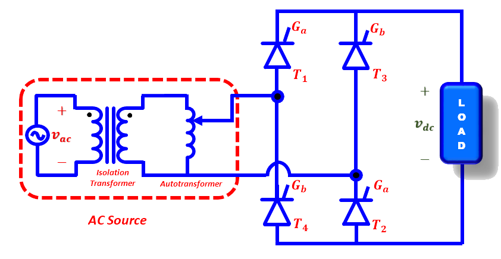
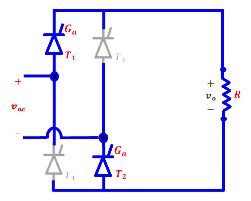
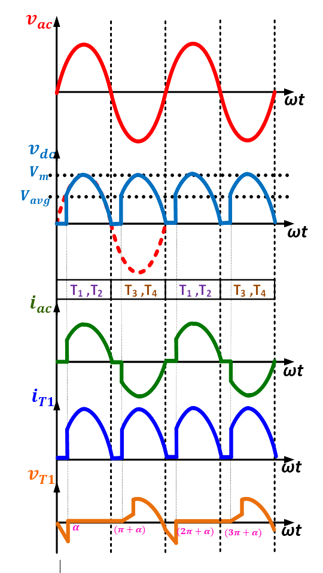
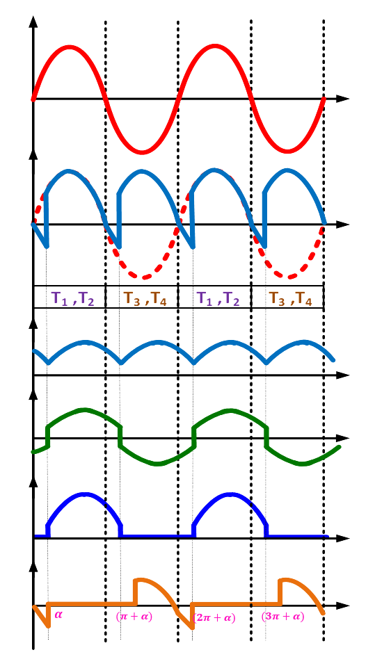

### Theory

  
  
Fig. 1. Silicon controlled rectifier/ Thyristor.

 
A thyristor typically consists of four layers, forming a P-N-P-N structure. The three terminals of a thyristor are: anode (A), cathode (K), and gate (G). 

The thyristor operates in four modes: Forward Blocking, Forward Conduction, Reverse Blocking, and Reverse Breakdown. 

The gate terminal controls the triggering of the thyristor. A small current applied to the gate terminal can turn the device on. Once turned ON, the gate loses control and the thyristor remains conducting until the current drops below the holding current level. 

The rectifier converts AC into DC. Thyristor-based rectifiers are widely used in various industrial applications due to their efficiency, controllability, and reliability. 

Thyristor-based rectifiers offer the advantage of controlled rectification, allowing precise control over the output voltage and current. By adjusting the firing angle, the average load voltage of the rectifier can be varied thus enabling smooth control of power delivered to the load. 

 

  
  
 Fig. 2. Circuit diagram of controlled rectifier.

 
The output voltage and power delivered can be controlled by changing the firing angle as shown in Fig. 3.
  

<table border="0" align="center" style="width:100%; border:none;">
  <tr>
<td style="width:50%">

  
Fig. 3(a). Positive-half cycle.
  

</td>
<td style="width:50%">
  

  
Fig. 3(b). Negative-half cycle.
  

 
    </td>
  </tr>
</table>
 

 
Fig. (2) shows a fully controlled bridge rectifier, which uses four thyristors to control the load voltage. Thyristors T1 and T2 must be fired simultaneously during the positive half cycle while Thyristors T3 and T4 must be fired simultaneously during the negative half cycle of the source voltage. All the thyristors must be given firing pulses of suitable pulse sequence.
  

**WITH R-LOAD**

 Fig.4a shows steady-state waveforms of controlled rectifier with R-load and based on these waveforms various equations are formulated. The average value of the output load voltage and current are:

 

 

  

    ..(1)

 

&nbsp;

  
      

    ..(2)

 

 
The RMS value of the output voltage V_rms and current I_rms are: 

  
      

    ..(3)

 

 
&nbsp;

  
      

    ..(4)

 

 
  The power delivered to the load is:

 

  
      

    ..(5)

 

 
Note: The RMS current of the source is the same as the RMS current of the load. 
Apparent power is:

 

  
      

    ..(6)

 

 
Input Power factor is: 
 

  
      

    ..(7)

  

<table border="0" align="center" style="width:100%; border:none;">
  <tr>
<td style="width:50%">

  
(a) Waveforms with R-Load.
  

</td>
<td style="width:50%">
  

  
(b) Waveforms with RL-Load.
  

 
    </td>
  </tr>
</table>

 

Fig. 4. Steady-state waveforms of controlled rectifier.

 

**WITH RL-LOAD**

 Fig. 4b shows steady-state waveforms of controlled rectifier with RL-load and based on these waveforms various equations are formulated:

 

 

 
The average (DC) output voltage and current are:
  

  
      

    ..(8)

 

 
&nbsp;

  
      

    ..(9)

 

 
The RMS value of the output voltage and current waveforms are formulated as:
 

  
      

    ..(10)

 

 
&nbsp;

  
      

    ..(11)

 

 
The input source current Fourier series expansion is:
  

  
      

    ..(12)

 

 
Where n = 1,2,3 .... 
The RMS value of the nth harmonic input current is:
 

  
      

    ..(13)

 

 
RMS value of the fundamental current is:
 

  
      

    ..(14)

 

 
The RMS value of input current is:
 

  
      

    ..(15)

 

 
Harmonic factor:
  

  
      

    ..(16)

 

 
Displacement factor:
  

  
      

    ..(17)

 

 
Power factor:
  

  
      

    ..(18)

 

 
Output power:
  

  
      

    ..(19)

  
#### ("For more Information on mathematical analysis, see references")
 

